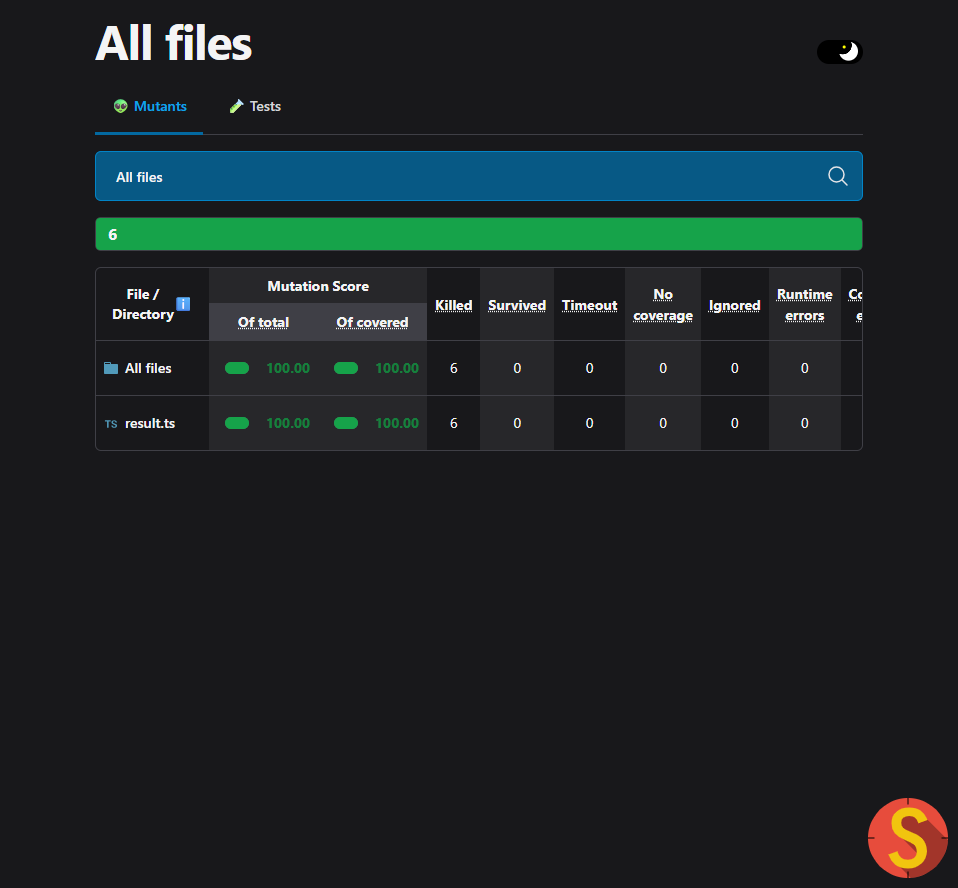
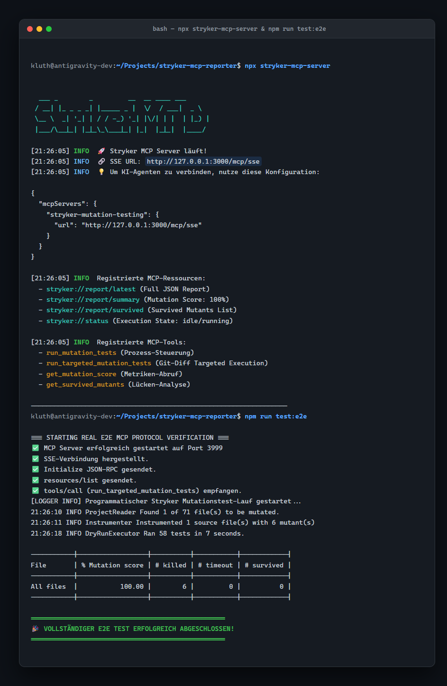

# ⚡ stryker-mcp-reporter & Control Server

[](https://www.npmjs.com/package/stryker-mcp-reporter)


Ein umfassendes **Stryker Mutator Plugin & Standalone Control Server**, das Mutation Testing Ergebnisse sowie **interaktive Steuerung per Model Context Protocol (MCP)** über SSE für KI-Agenten (z. B. Antigravity, Cursor, Cline, Roo Code, Claude) bereitstellt.

---

## 📸 In Aktion (Reale Screenshots)

### 📊 1. Echter Stryker HTML Mutation Testing Report


### 🧬 2. Mutanten-Detailanalyse & Quellcode-Instrumentierung


### 💻 3. Standalone MCP Control Server & Real-Time Protocol Verification (`npm run test:e2e`)


---

## 🌟 Hauptmerkmale

* **⚡ Interaktives Mutation Testing**: KI-Agenten können Mutationstests gezielt per Tool-Call anstoßen, beobachten und auswerten.
* **🎯 Targeted Git-Diff Executions**: Mit `run_targeted_mutation_tests` werden nur die in Git geänderten TypeScript-Dateien getestet – spart bis zu 90% Laufzeit!
* **📦 Live MCP Resources**: Greife über standardisierte URIs wie `stryker://report/survived` oder `stryker://status` auf Testdaten zu.
* **🤖 KI-Assolidierte Testgenerierung**: Der `analyze_survived_mutants`-Prompt leitet KI-Agenten an, überlebende Mutanten nach TDD-Prinzipien mit exakten Vitest/Jest Tests zu eliminieren.
* **🧠 Vector DB & RAG-Ready Insights**: Bündelt Testergebnisse in hochstrukturierte `MutationInsightEntity`-Objekte für automatisierte Entwickler-Fortbildungen und Skill-Gap-Analysen.

---

## 📦 Installation

**Voraussetzungen:** Node.js >= 22.0.0 und `@stryker-mutator/core` >= 8.0.0.

Installiere das Plugin in deinem Projekt:

```bash
npm install --save-dev stryker-mcp-reporter
```

---

## 🚀 Betriebsmodi

### Modus 1: Stryker Reporter Plugin

Füge das Plugin und den Reporter zu deiner `stryker.config.mjs` hinzu:

```javascript
// stryker.config.mjs
export default {
  plugins: [
    "@stryker-mutator/*",
    "stryker-mcp-reporter",
  ],
  reporters: [
    "clear-text",
    "progress",
    "mcp", // MCP Reporter aktivieren
  ],
};
```

Beim Ausführen von `npx stryker run` startet der MCP-Server nach dem Testlauf automatisch auf `http://127.0.0.1:3000/mcp/sse`.

### Modus 2: Standalone MCP Control Server

Starte den MCP Server direkt über die CLI:

```bash
npx stryker-mcp-server
```

Der Server steht dauerhaft bereit und erlaubt KI-Agenten das dynamische Ausführen von Mutationstests per MCP Tool Call.

---

## 🔌 MCP Schnittstellen

### 📦 Resources (Datenabruf)

| Resource URI | MimeType | Beschreibung |
| :--- | :--- | :--- |
| `stryker://report/latest` | `application/json` | Der vollständige Stryker Mutation Testing Report im JSON-Format. |
| `stryker://report/summary` | `application/json` | Kompakte Zusammenfassung der Mutations-Metriken (Score, Killed, Survived). |
| `stryker://report/survived` | `application/json` | Liste aller überlebenden Mutanten inkl. Pfad, Zeile, Mutator & Ersetzung. |
| `stryker://status` | `application/json` | Aktueller Ausführungsstatus von Stryker (`idle`, `running`, `completed`, `failed`). |

### 🛠️ Tools (Interaktive Steuerung)

| Tool Name | Parameter | Beschreibung |
| :--- | :--- | :--- |
| `run_mutation_tests` | `mutate`, `concurrency`, `testRunner`, `configFile` | Startet einen vollständigen oder spezifischen Mutationstest-Lauf. |
| `run_targeted_mutation_tests` | `baseBranch` | Erkennt in Git geänderte TypeScript-Dateien (`git diff`) und testet gezielt nur diese. |
| `get_mutation_score` | - | Ruft den aktuellen Mutationsscore und die Gesamtzusammenfassung ab. |
| `get_survived_mutants` | `filePath` | Liefert alle überlebenden Mutanten inkl. Dateipfad, Zeile, Mutator-Typ & Ersetzungscode. |

### 💡 Prompts (KI-gestützte Testgenerierung)

* **`analyze_survived_mutants`**: Erzeugt eine strukturierte KI-Instruktion zur detaillierten Ursachenanalyse überlebender Mutanten und zur automatischen Erstellung fehlender Unit Tests nach TDD-Standards.

---

## 🧠 Vector DB & Developer Skill-Gap Data Model

`stryker-mcp-reporter` transformiert rohe Mutanten-Ergebnisse in angereicherte `MutationInsightEntity`-Objekte. Diese enthalten:

1. **Mutator-Kategorie**: (z. B. `Arithmetic & Math`, `Equality & Logic`, `Exception Handling`).
2. **Architekturschicht**: (z. B. `Domain`, `Application`, `Infrastructure`).
3. **Risikoscore & Schweregrad**: Automatisches Scoring (0 – 100) zur Priorisierung von Testlücken.
4. **Embedding Payload**: Vektor-DB ready Text-String für RAG-Pipelines (Qdrant, Pinecone, ChromaDB).

---

## 🗺️ Feature Roadmap (150 Features)

Eine umfassende Übersicht über geplante und zukünftige Erweiterungen in 9 Kategorien findest du im Feature-Katalog.

---

## 🏗️ Software Engineering & Qualitätssicherung

* **Clean Architecture & Hexagonal Design:** Die Kern-Domäne (`src/core/domain/`) ist vollständig von der Infrastruktur (`Express`, `MCP SDK`, `@stryker-mutator/core`) getrennt.
* **TDD & 100% Mutation Coverage:** Vollständige Testabdeckung in Vitest sowie fortlaufendes Mutation Testing über Stryker.
* **Automatisierte E2E Protokollprüfung:** Verifikation über `npm run test:e2e` prüft das echte SSE JSON-RPC 2.0 Protokoll.

---

## 🛠️ Lokale Entwicklung

```bash
npm install          # Abhängigkeiten installieren
npm run build        # TypeScript Build
npm run test         # Unit Tests (Vitest)
npm run test:e2e     # Real E2E MCP Protocol Verification
npm run test:mutation# Mutation Testing (Stryker)
```

---

## 📝 Lizenz

MIT License © 2026 Matthias Kluth