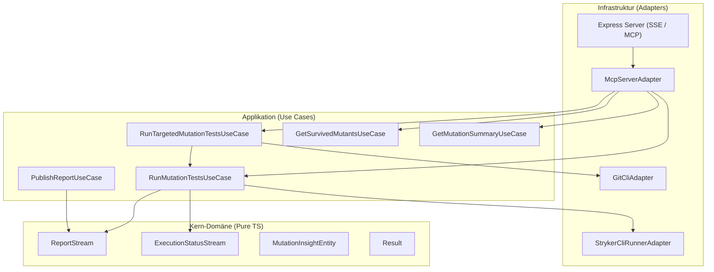

# ⚡ stryker-mcp-reporter & Control Server

<div align="center">

[](https://www.npmjs.com/package/stryker-mcp-reporter)
[](https://nodejs.org/)
[](https://stryker-mutator.io/)
[](#-software-engineering--architektur-highlights)
[](https://github.com/kluth/stryker-mcp-reporter/discussions)
[](LICENSE)

> **"100% Code Coverage sagt dir nur, was ausgeführt wurde. Stryker MCP befähigt deine KI zu beweisen, was unzerstörbar ist."**

Ein hochmodernes **Stryker Mutator Plugin & Standalone Control Server**, das Mutation Testing Ergebnisse sowie **interaktive Steuerung per Model Context Protocol (MCP)** über SSE und stdio für KI-Agenten (*Antigravity, Cursor, Cline, Roo Code, Claude Desktop*) bereitstellt.

[🚀 Quickstart](#-installation--schnellstart) • [🤖 KI-Agenten Setup](#-interaktives-ki-agenten-setup) • [🏗️ Architektur](#-software-engineering--architektur-highlights) • [🤝 Contributing](#-contributor-onboarding--community)

</div>

---

## 📖 Die Story: Warum stryker-mcp-reporter?

> [!IMPORTANT]
> **Das 100% Coverage-Paradoxon:**  
> Standard Code Coverage misst lediglich, welche Zeilen Code während eines Tests einmal ausgeführt wurden – selbst wenn deine Tests schwache oder gar keine Assertions enthalten. Generative KI-Agenten schreiben heute in Sekunden hunderte Zeilen Testcode, neigen aber zum "Happy Path Bias" und lassen logische Randfälle unbemerkt durch.

**Die Stryker MCP Revolution:**  
Stryker mutiert deinen Quellcode (z. B. verwandelt es `>` in `>=`, löscht Rückgabewerte oder invertiert Logik). Überlebt ein Mutant, existiert eine unsichtbare Testlücke.  
**`stryker-mcp-reporter` macht diese Mutanten für KI-Agenten lesbar und steuerbar.** KI-Pair-Programmer erkennen Lücken autonom, schreiben exakte Grenzwert-Tests und eliminieren überlebende Mutanten in Echtzeit.

---

## 📸 In Aktion (Reale Screenshots)

### 📊 1. Echter Stryker HTML Mutation Testing Report


### 🧬 2. Mutanten-Detailanalyse mit In-Line Code Diff


### 💻 3. Standalone MCP Control Server & Real-Time Protocol Verification (`npm run test:e2e`)


---

## 🌟 Hauptmerkmale

* ⚡ **Interaktives Mutation Testing**: KI-Agenten können Mutationstests gezielt per MCP-Tool-Call anstoßen, beobachten und auswerten.
* 🎯 **Targeted Git-Diff Executions**: Mit `run_targeted_mutation_tests` werden nur die in Git geänderten TypeScript-Dateien getestet – **spart bis zu 90% Laufzeit!**
* 📦 **Live MCP Resources**: Greife über URIs wie `stryker://report/survived` oder `stryker://status` direkt auf Testdaten zu.
* 🤖 **Agentic Testgenerierung**: Der `analyze_survived_mutants`-Prompt leitet KI-Agenten an, überlebende Mutanten nach TDD-Prinzipien mit exakten Vitest/Jest-Tests zu eliminieren.
* 🧠 **Vector DB & RAG-Ready Insights**: Bündelt Testergebnisse in hochstrukturierte `MutationInsightEntity`-Objekte für automatisierte Entwickler-Fortbildungen und Skill-Gap-Analysen.

---

## 📦 Installation & Schnellstart

**Voraussetzungen:** Node.js >= 22.0.0 und `@stryker-mutator/core` >= 8.0.0.

Installiere das Plugin in deinem Projekt:

```bash
npm install --save-dev stryker-mcp-reporter
```

### Modus 1: Stryker Reporter Plugin

Füge das Plugin und den Reporter zu deiner `stryker.config.mjs` hinzu:

```javascript
// stryker.config.mjs
export default {
  plugins: [
    "@stryker-mutator/*",
    "stryker-mcp-reporter",
  ],
  reporters: [
    "clear-text",
    "progress",
    "mcp", // MCP Reporter aktivieren
  ],
};
```

Beim Ausführen von `npx stryker run` startet der MCP-Server nach dem Testlauf automatisch auf `http://127.0.0.1:3000/mcp/sse`.

### Modus 2: Standalone MCP Control Server

Starte den MCP Server direkt über die CLI:

```bash
# STDIO Modus (für lokale KI-Tools & direktes Spawning):
npx stryker-mcp-server --stdio

# Oder SSE Modus (Server-Sent Events via HTTP Port 3000):
npx stryker-mcp-server --sse
```

Der Server steht dauerhaft bereit und erlaubt KI-Agenten das dynamische Ausführen von Mutationstests per MCP Tool Call.

---

## 🤖 Interaktives KI-Agenten Setup

Verbinde deine bevorzugte KI-Entwicklungsumgebung im Handumdrehen mit `stryker-mcp-reporter`. Du kannst zwischen **STDIO** (direktes Spawning via CLI, empfohlen) und **SSE** (HTTP/Server-Sent Events) wählen.

### 🌟 Option A: STDIO Transport (Empfohlen für lokale IDEs & KI-Tools)

Wähle die passende Konfiguration für dein Betriebssystem aus:

#### 🐧 🍏 Linux & macOS (`npx`):
```json
{
  "mcpServers": {
    "stryker-mutation-testing": {
      "command": "npx",
      "args": ["-y", "--silent", "stryker-mcp-reporter"]
    }
  }
}
```

#### 🪟 Windows (`cmd.exe` Wrapper - empfohlener Npx-Start):
> **Warum `cmd.exe`?** Auf Windows ist `npx` ein Batch-Skript (`npx.cmd`). Viele KI-Tools starten Prozesse ohne Shell-Kontext. `cmd.exe /c` stellt den sauberen Start sicher und das `--silent`-Flag verhindert `stdout`-Verschmutzung.

```json
{
  "mcpServers": {
    "stryker-mutation-testing": {
      "command": "cmd.exe",
      "args": [
        "/c",
        "npx",
        "-y",
        "--silent",
        "stryker-mcp-reporter"
      ]
    }
  }
}
```

#### ⚡ Direkter Pfad (Lokale Entwicklung / Maximale Geschwindigkeit):
```json
{
  "mcpServers": {
    "stryker-mutation-testing": {
      "command": "node",
      "args": [
        "C:\\Users\\DEIN_BENUTZER\\Projects\\stryker-mcp-reporter\\bin\\stryker-mcp-server.js"
      ]
    }
  }
}
```

---

### 🌐 Option B: SSE Transport (Server-Sent Events via HTTP)

Starte den MCP Server vorher im Hintergrund via `npx stryker-mcp-server --sse` und trage folgende URL ein:

```json
{
  "mcpServers": {
    "stryker-mutation-testing": {
      "url": "http://127.0.0.1:3000/mcp/sse"
    }
  }
}
```

---

### 1. 🪐 Google Antigravity (Antigravity CLI / IDE)

Konfigurationsdatei `.antigravity/mcp.json` oder global unter `~/.gemini/antigravity-cli/mcp.json`:

```json
{
  "mcpServers": {
    "stryker-mutation-testing": {
      "command": "cmd.exe",
      "args": ["/c", "npx", "-y", "--silent", "stryker-mcp-reporter"]
    }
  }
}
```

### 2. ⚡ Cursor IDE

Datei `.cursor/mcp.json` (*Settings -> Features -> MCP*):

```json
{
  "mcpServers": {
    "stryker-mutation-testing": {
      "command": "cmd.exe",
      "args": ["/c", "npx", "-y", "--silent", "stryker-mcp-reporter"]
    }
  }
}
```

### 3. 🧩 Cline & Roo Code (VS Code Extension)

Einstellungen (`cline_mcp_settings.json` / `roo_code_mcp_settings.json`):

```json
{
  "mcpServers": {
    "stryker-mutation-testing": {
      "command": "cmd.exe",
      "args": ["/c", "npx", "-y", "--silent", "stryker-mcp-reporter"]
    }
  }
}
```

### 4. 🧡 Claude Desktop

Editiere deine Claude Desktop Konfigurationsdatei (`claude_desktop_config.json`):
* **Windows**: `%APPDATA%\Claude\claude_desktop_config.json`
* **macOS**: `~/Library/Application Support/Claude/claude_desktop_config.json`

```json
{
  "mcpServers": {
    "stryker-mutation-testing": {
      "command": "cmd.exe",
      "args": ["/c", "npx", "-y", "--silent", "stryker-mcp-reporter"]
    }
  }
}
```

---

## 🔌 MCP Schnittstellen

### 📦 Resources (Datenabruf)

| Resource URI | MimeType | Beschreibung |
| :--- | :--- | :--- |
| `stryker://report/latest` | `application/json` | Der vollständige Stryker Mutation Testing Report im JSON-Format. |
| `stryker://report/summary` | `application/json` | Kompakte Zusammenfassung der Mutations-Metriken (Score, Killed, Survived). |
| `stryker://report/survived` | `application/json` | Liste aller überlebenden Mutanten inkl. Pfad, Zeile, Mutator & Ersetzung. |
| `stryker://status` | `application/json` | Aktueller Ausführungsstatus von Stryker (`idle`, `running`, `completed`, `failed`). |

### 🛠️ Tools (Interaktive Steuerung)

| Tool Name | Parameter | Beschreibung |
| :--- | :--- | :--- |
| `run_mutation_tests` | `mutate`, `concurrency`, `testRunner`, `configFile` | Startet einen vollständigen oder spezifischen Mutationstest-Lauf. |
| `run_targeted_mutation_tests` | `baseBranch` | Erkennt in Git geänderte TypeScript-Dateien (`git diff`) und testet gezielt nur diese. |
| `get_mutation_score` | - | Ruft den aktuellen Mutationsscore und die Gesamtzusammenfassung ab. |
| `get_survived_mutants` | `filePath` | Liefert alle überlebenden Mutanten inkl. Dateipfad, Zeile, Mutator-Typ & Ersetzungscode. |

### 💡 Prompts (KI-gestützte Testgenerierung)

* **`analyze_survived_mutants`**: Erzeugt eine strukturierte KI-Instruktion zur detaillierten Ursachenanalyse überlebender Mutanten und zur automatischen Erstellung fehlender Unit Tests nach TDD-Standards.

---

## 🏗️ Software Engineering & Architektur-Highlights

`stryker-mcp-reporter` ist nach den Prinzipien der **Clean Architecture / Hexagonal Architecture** aufgebaut, um maximale Testbarkeit, Wartbarkeit und Entkopplung zu gewährleisten.



---

## 🧠 Vector DB & Developer Skill-Gap Data Model

`stryker-mcp-reporter` transformiert rohe Mutanten-Ergebnisse in angereicherte `MutationInsightEntity`-Objekte. Diese enthalten strukturierte Daten zur Speicherung in Vektordatenbanken (Qdrant, Pinecone, ChromaDB, Weaviate) für RAG-Pipelines:

1. **Mutator-Kategorie**: (z. B. `Arithmetic & Math`, `Equality & Logic`, `Exception Handling`).
2. **Architekturschicht**: (z. B. `Domain`, `Application`, `Infrastructure`).
3. **Risikoscore & Schweregrad**: Automatisches Scoring (0 – 100) zur Priorisierung von Testlücken.
4. **Embedding Payload**: Vektor-DB-ready Text-String für automatisierte KI-Trainings und Entwickler-Analysen.

---

## 🤝 Contributor Onboarding & Community

Wir freuen uns über jede Unterstützung! Egal ob Bugfix, neue MCP-Tools oder Dokumentations-Verbesserungen.

### 🏁 Quickstart für Contributor

```bash
git clone https://github.com/kluth/stryker-mcp-reporter.git
cd stryker-mcp-reporter
npm install
npm test              # Unit Tests (Vitest)
npm run test:e2e      # Real E2E MCP SSE Protocol Verification
npm run test:mutation # Stryker Mutation Testing (100% Target)
```

---

## 📝 Lizenz

MIT License © 2026 Matthias Kluth