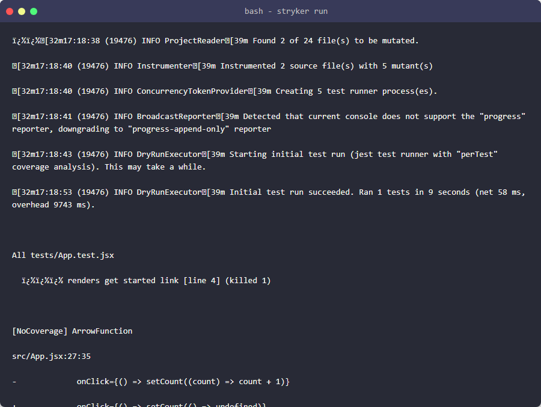

# Usage & Features

The Stryker MCP Reporter provides specific tools and prompts to seamlessly bridge Mutation Testing with LLM reasoning.

## Tools

### 1. `run_mutation_tests`

Executes Stryker in the specified project path.
- **Parameters:**
  - `mutate` (optional): Array of file patterns to mutate (e.g., `["src/core/**/*.ts"]`).
  - `concurrency` (optional): Number of concurrent test runners.
- **What it does:** Forces the JSON reporter, runs Stryker programmatically, and parses the resulting `mutation.json`. It keeps the results in memory.

### 2. `get_risk_score`
Calculates the risk of deploying the current codebase based on the latest mutation test run.
- **What it does:** It groups surviving mutants by file and applies a risk weight. Files related to "auth", "security", "crypto", etc., receive a 10x multiplier on surviving mutants! It will output a Risk Level (LOW, MEDIUM, HIGH, CRITICAL).

### 3. `suggest_mutant_fixes` (Hybrid Auto-Remediation Profiling)
Provides precise code suggestions to kill surviving mutants.
- **What it does:** Uses a hybrid approach combining static analysis and dynamic test profiling to craft highly accurate, contextual remediation code for surviving mutants. It outputs ready-to-use assertions and boundary tests for the AI agent to implement.

## Prompts

### `why_is_this_bad`
This is a core workflow feature. Once a mutation run has been completed, you can ask the AI to evaluate **why** a surviving mutant is bad.

- **How it works:** The MCP server extracts the surviving mutants and the exact location in the code. It provides the **Original Code vs. Mutated Code** context directly to the LLM.
- **Use Case:** "The mutant changed `score >= 50` to `true`. Why is this bad?" -> The AI will tell you that a CRITICAL risk level will always be assigned regardless of the actual score, potentially causing false alarms or broken security alerts in production.
